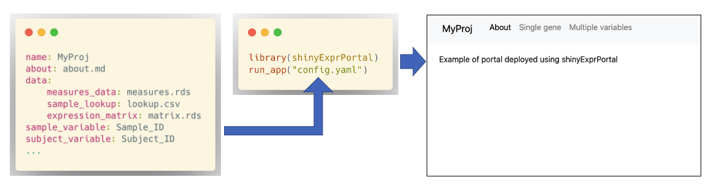

<!-- README.md is generated from README.Rmd. Please edit that file -->

```{r, include = FALSE}
knitr::opts_chunk$set(
  collapse = TRUE,
  comment = "#>",
  fig.path = "man/figures/README-",
  out.width = "100%"
)
```

# shinyExprPortal

<!-- badges: start -->
[](https://github.com/C4TB/shinyExprPortal/actions/workflows/R-CMD-check.yaml)
<!-- badges: end -->

*shinyExprPortal* is a configurable Shiny portal for visual exploration and analysis showcase of molecular expression data and phenotype data, such as observed clinical measures. The package is designed for deploying portals using a text-based configuration file with minimal programming. The portal includes modules for exploring correlations between expression and measures, visualizing the results of differential expression analysis and showcasing results of other downstream analysis methods such as pathways and correlated networks. The interface is designed for gene expression, but the computational methods are compatible with any matrix with samples in columns and entities, such as proteins, in rows.



For initial exploration, any expression matrix containing abundance or counts and data frames containing observed measures can be loaded in. For differential expression and other methods, the package is compatible with the outputs of packages such as limma and WCGNA. The correlation modules can be used early in the lifecycle of a bioinformatics project, while the other modules can be added as new downstream analysis results are produced. The use of the configuration file also means that the portal can be easily versioned.

## How to start

You can install the latest version of the package using:

``` r
devtools::install_github("C4TB/shinExprPortal", dependencies = TRUE)
```

If you have samples for one set of subjects, you can check [`vignette("shinyExprPortal")`](https://c4tb.github.io/shinyExprPortal/articles/shinyExprPortal.html) for a quick start guide to set up the configuration file.

If your subjects have one more samples, e.g. collected over time or from different tissues, you should check the data preparation guide in [`vignette("dataprep")`](https://c4tb.github.io/shinyExprPortal/articles/dataprep.html) and the full configuration guide [`vignette("config")`](https://c4tb.github.io/shinyExprPortal/articles/config.html)

Once you have completed either of the steps above, you can open and run the resulting app.R file to test the portal.

## Module documentation

The full configuration guide in [`vignette("config")`](https://c4tb.github.io/shinyExprPortal/articles/config.html) describes all the dependencies, file requirements, mandatory and optional settings for each of the modules currently supported by the portal.

## Customization and extending

[`vignette("customization")`](https://c4tb.github.io/shinyExprPortal/articles/customization.html) describes how to customize the visual style of the portal and how to add new functionality through programming. The package supports customization through the configuration file at a global level using [bslib](https://cran.r-project.org/web/packages/bslib/index.html) and some modules enable customizing colors used in the visualizations.

The package is also compatible with new modules that are added without modifying the source code of the portal or the package. New functionality can be developed and tested without having to clone the repository or recompile the package.
