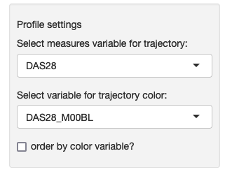
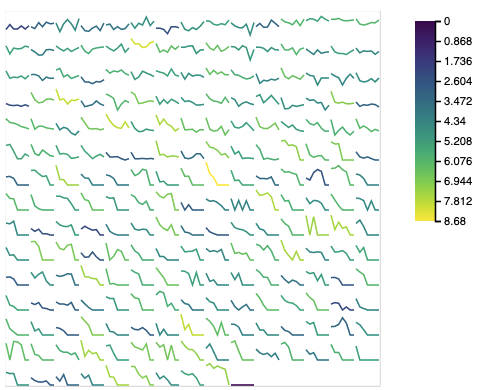

### Cohort overview

This module shows a map of temporal trajectories for a selected measure over time. Each patient is represented by a small line, and the lines are ordered in a left-to-right, top-bottom manner. The measures shown over time are defined by the authors of the study shared in this portal.

<table>
<colgroup>
<col style="width: 50%"/>
<col style="width: 60%"/>
</colgroup>
<tbody>
<tr>
	<td></td>
	<td>On the sidebar, you can choose the measure that is displayed on the line and a measure that is used to color each line. You can also use the same color measure to reorder the lines from highest to lowest value.</td>
</tr>
<tr>
	<td></td>
	<td>The default ordering uses the difference between the last and first values of each trajectory, in decreasing order.</td>
</tr>

</tbody>
</table>

Module name in configuration file: *cohortOverview*