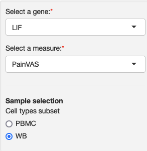
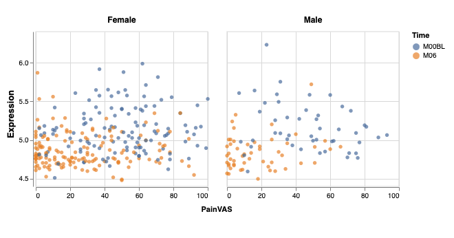

### Compare trajectories of groups

This module displays scatterplots with the expression of a selected gene and a selected observed measure over time. Each scatterplot contains a subset of samples/patients that is defined by the study authors. This module is useful to see how expression changes over time relative to a measure such as disease activity.

<table>
<colgroup>
<col style="width: 50%"/>
<col style="width: 60%"/>
</colgroup>
<tbody>
<tr>
	<td></td>
	<td>On the sidebar, you can select a gene, a measure and a subset of samples to compare. Note that samples are already split based on the portal configuration by the study authors: one category is used to separate the scatterplots and the other is the time category.</td>
</tr>
<tr>
	<td></td>
	<td>Time is used to color the points</td>
</tr>

</tbody>
</table>

Module name in configuration file: *compareTrajGroups*