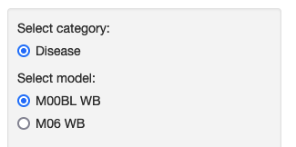
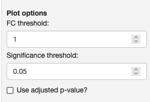
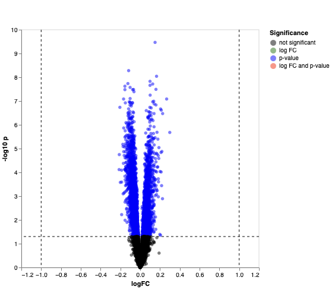
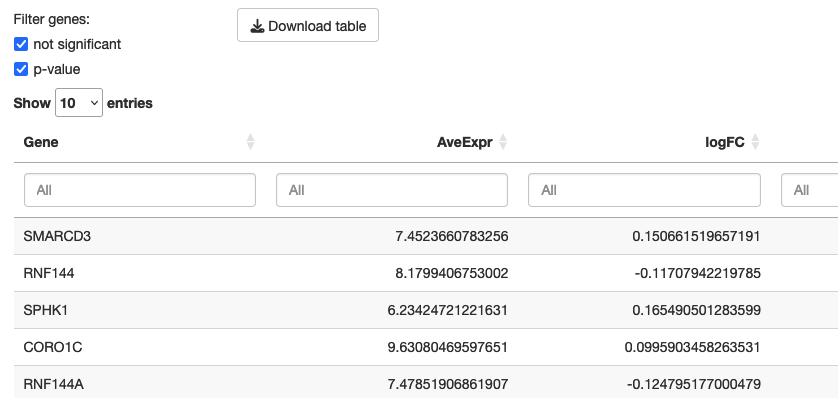

### Detailed results of differential expression analysis

This module displays volcano plots and tables of results of differential expression models that have been precomputed and loaded by the study authors.

<table>
<colgroup>
<col style="width: 50%"/>
<col style="width: 60%"/>
</colgroup>
<tbody>
<tr>
	<td></td>
	<td>On the sidebar, you can select a category of models and then a specific model to display its results. The categories and models are defined by portal authors.</td>
</tr>
<tr>
	<td></td>
	<td>You can also define the fold change and p-value thresholds to categorize the genes between full significance, partial (only fold change or p-value) and not significant. Here it is also possible to switch between unadjusted and adjusted p-values.</td>
</tr>
<tr>
	<td></td>
	<td>A volcano plot is displayed if the model results include fold change measures. The dashed lines represent the thresholds defined in the plot options. Next to the volcano plot, you can also search for genes to highlight in the plot. If there is too much overlap, some gene names may not be displayed.</td>
</tr>
<tr>
	<td></td>
	<td>A table with the differential expression model results is displayed below the volcano plot. You can use the checkboxes to include only significant genes. The columns in this table reflect the file loaded by the study authors: the portal software does not change any of these files.</td>
</tr>

</tbody>
</table>

Module name in configuration file: *degDetails*