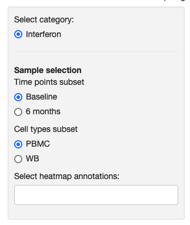
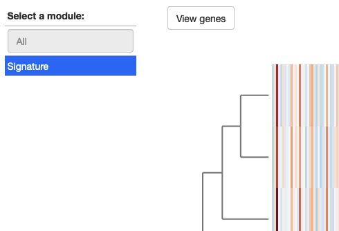

### Gene modules heatmap

This module displays heatmaps and scatterplots of modules/clusters/groups of genes. The heatmaps show the expression, while the scatterplots (if defined by the study authors) show observed measures and the average module expression for each sample.

<table>
<colgroup>
<col style="width: 50%"/>
<col style="width: 60%"/>
</colgroup>
<tbody>
<tr>
	<td></td>
	<td>On the sidebar, you can select a category of modules and define a selection of samples to find the corresponding modules. You can also choose multiple observed variables to show as annotations above the heatmap.</td>
</tr>
<tr>
	<td></td>
	<td>Once a category and sample subset are selected, a table shows the available modules for that combination. Depending on how the portal was set up, the module may contain the same genes for any sample selection or different genes, if a module is specific to a particular subset. For example, in this example, an interferon signature is the same across all cell types and time points. You can view the genes that are included in each module by clicking the button. If the study authors configured them, the scatterplots will appear below the heatmap.</td>
</tr>

</tbody>
</table>

Module name in configuration file: *geneModulesHeatmap*