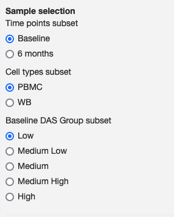
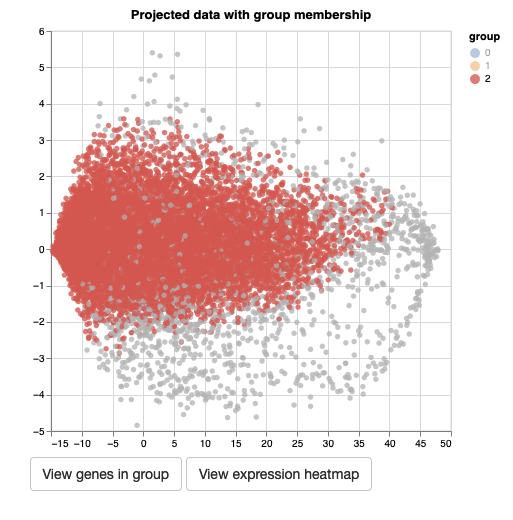

### Gene projection overlay

This module displays two scatterplots of a precomputed 2D projection of genes. The objective of the module is to allow the exploration of the relationship between the genes using a dimensionality reduction method and an expression overlay. In the overlay, the color of each projected gene is the average expression of the samples selected on the sidebar. 

<table>
<colgroup>
<col style="width: 50%"/>
<col style="width: 60%"/>
</colgroup>
<tbody>
<tr>
	<td></td>
	<td>On the sidebar, you can select the subset of samples that will be used to compute the average expression in the overlay.</td>
</tr>
<tr>
	<td></td>
	<td>The checkboxes allow you to select gene groups to hide from the scatterplot.</td>
</tr>
<tr>
	<td></td>
	<td>In the scatterplot, you can click on a single point to highlight that group of genes. All other groups will be displayed in gray. Once you click on a group, you can also click on the buttons below the scatterplots to view the genes that are in that group and the heatmap with the expression of the genes. Please note that if the groups are too big the heatmap may become unreadable.</td>
</tr>

</tbody>
</table>

Module name in configuration file: *geneModulesHeatmap*