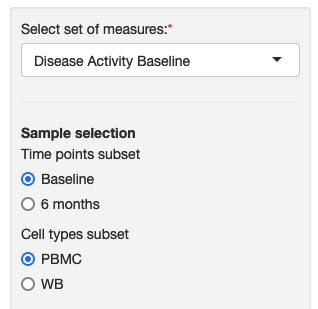
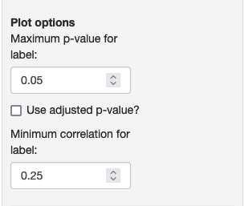
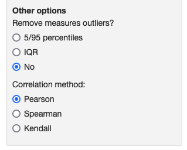
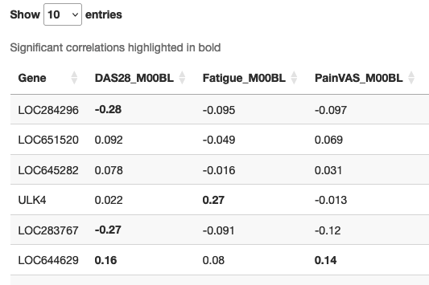

### Correlations between all genes and multiple measures

This module allows you to explore the relationship between the expression of all genes and sets of measures through correlation, with results displayed on a heatmap.

<table>
<colgroup>
<col style="width: 40%"/>
<col style="width: 50%"/>
</colgroup>
<tbody>
<tr>
	<td></td>
	<td>On the sidebar, you can choose the sets of measures from the dropdown list and define the subset of samples that you want to explore. The names and groups of measures are defined by the study authors.</td>
</tr>
<tr>
	<td></td>
	<td>Below the subset filter, there are three plot options: the maximum p-value to display the correlation estimate label on the heatmap, a checkbox to use an adjusted p-value for the filtering and the minimum correlation value to display the label.</td>
</tr>
<tr>
	<td></td>
	<td>Depending on how the study authors configured the portal, you may see additional options below the sidebar, such as coloring options, outlier filtering, the correlation measure (Pearson, Spearman or Kendall) used and the line fitting method used (linear, quadratic or cubic).</td>
</tr>
<tr>
	<td></td>
	<td>Once you select a group, the heatmap and a corresponding table will be displayed. The table reveals the underlying values of the heatmap and can be downloaded using the button at the bottom.</td>
</tr>

</tbody>
</table>

Module name in configuration file: *multiMeasureCorr*