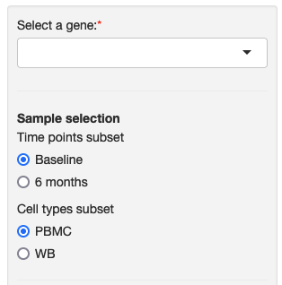
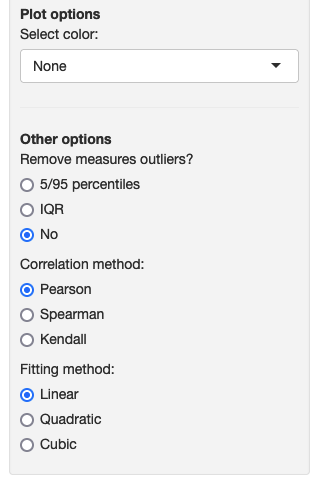
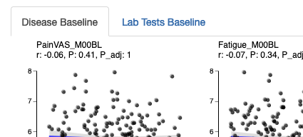

### Correlations between single gene and measures

This module allows you to explore the relationship between the expression of a single gene and various observed measures through scatterplots and correlation measures.

<table>
<colgroup>
<col style="width: 40%"/>
<col style="width: 60%"/>
</colgroup>
<tbody>
<tr>
	<td></td>
	<td>On the sidebar, you can choose the gene from the dropdown list and define the subset of samples that you want to explore. A message will appear if a gene is not found in the subset, for example, because it has been filtered out during preprocessing.</td>
</tr>
<tr>
	<td></td>
	<td>Depending on how the study authors configured the portal, you may see additional options below the sidebar, such as coloring options, outlier filtering, the correlation measure (Pearson, Spearman or Kendall) used and the line fitting method used (linear, quadratic or cubic).</td>
</tr>
<tr>
	<td></td>
	<td>Once you select a gene, the scatterplots will be displayed. If the portal is configured to have multiple pages of scatterplots, you can navigate between the tabs.</td>
</tr>

</tbody>
</table>

Module name in configuration file: *singleGeneCorr*