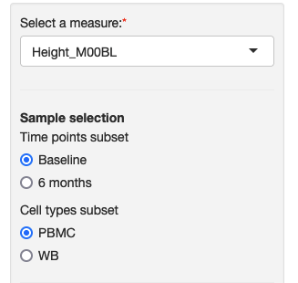
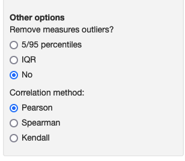
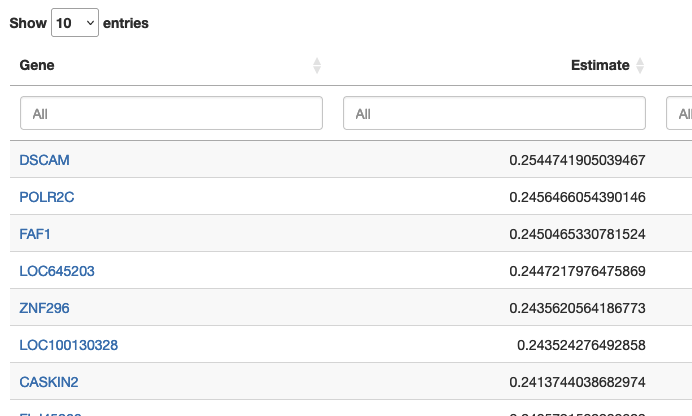

### Correlations between single measure and all genes 

This module allows you to explore the relationship between the expression of all genes and a single observed measure through correlation.

<table>
<colgroup>
<col style="width: 30%"/>
<col style="width: 70%"/>
</colgroup>
<tbody>
<tr>
	<td></td>
	<td>On the sidebar, you can choose the observed measure from the dropdown list and define the subset of samples that you want to explore.</td>
</tr>
<tr>
	<td></td>
	<td>Depending on how the study authors configured the portal, you may see additional options below the sidebar, such as coloring options, outlier filtering, the correlation measure (Pearson, Spearman or Kendall) used and the line fitting method used (linear, quadratic or cubic).</td>
</tr>
<tr>
	<td></td>
	<td>Once you select a measure, the results table will be displayed with the correlation, p value and adjusted p value. You can use the boxes above the table to look for a gene or restrict the range of correlation and p-values. You can also click on the column names to reorder the rows of the table and download the table using the button at the bottom.</td>
</tr>

</tbody>
</table>

Module name in configuration file: *singleMeasureCorr*