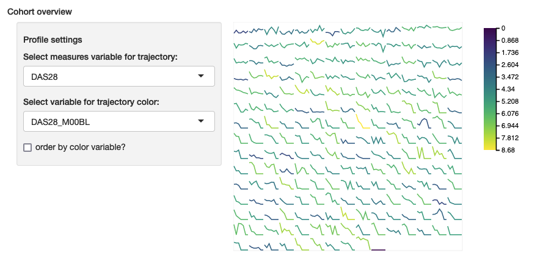
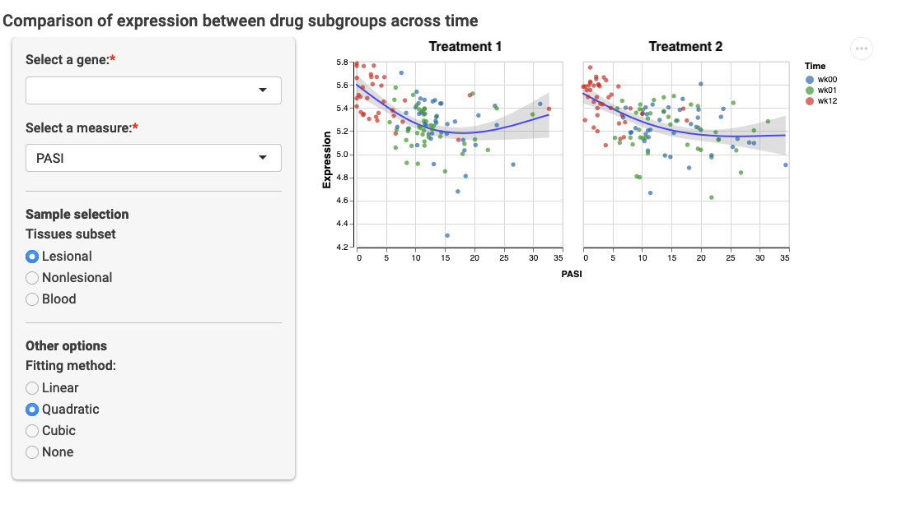
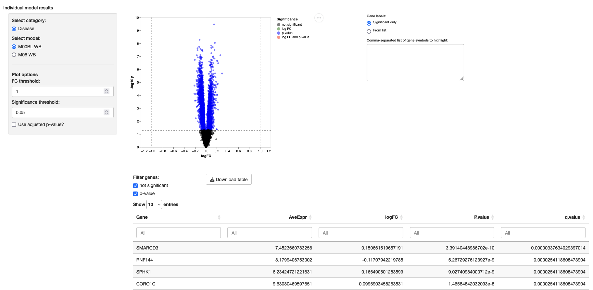
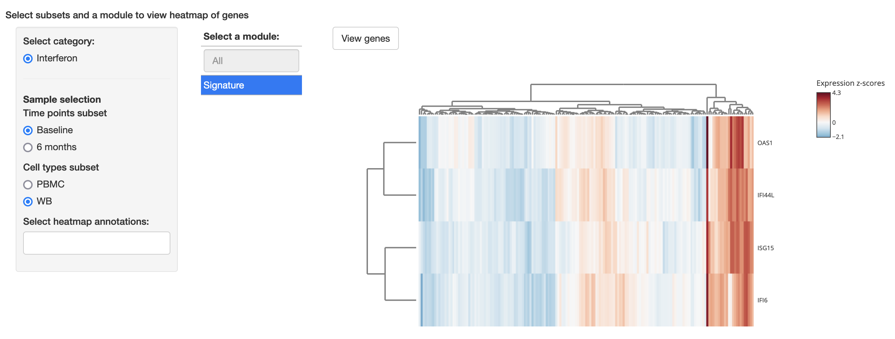
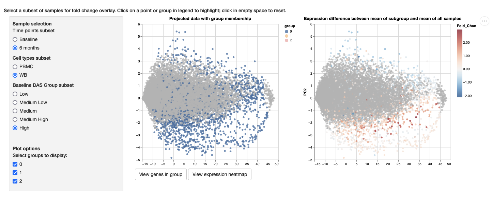
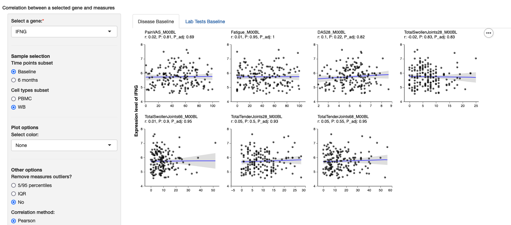
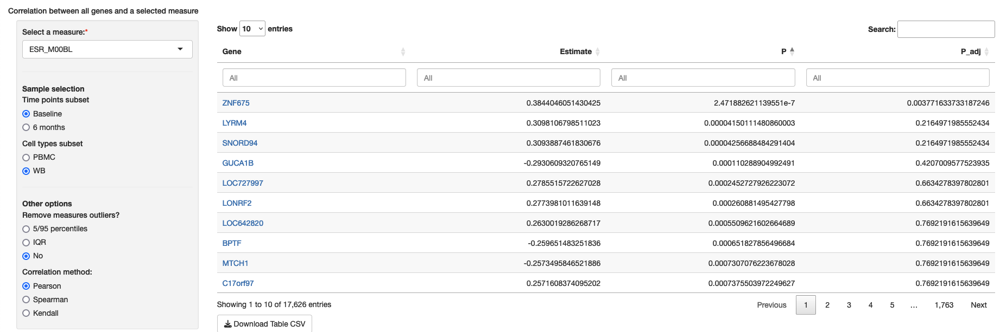
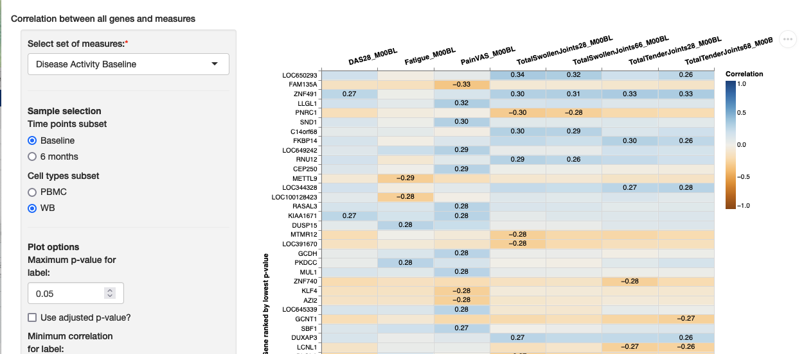

```{r, include = FALSE}
knitr::opts_chunk$set(
  collapse = TRUE,
  comment = "#>",
  eval = FALSE
)
```

```{r, include = FALSE, eval = FALSE, echo = FALSE}
library(shinyExprPortal)
```

This is a complete guide to create a configuration file for all modules supported by the current version of shinyExprPortal. It includes a minimal setup example, as well as optional advanced and customization settings. It assumes that that you have already created an initial configuration file and prepared the expression, measures and lookup table files. If you have not concluded that first step yet, please check the [Data Preparation Guide](dataprep.html).

## Configuration file 

**YAML syntax**: configuration fields are defined with a colon (:). Lists of values are defined using hyphens or square brackets (e.g. ["A", "B", "C"]. Besides text, lists can contain complex objects, with fields listed with a key-value pair. Values without spaces do not need double quotes, but it is not a problem to use them. Examples:

```yaml
# Hyphenated list example
Name:
  - Value1
  - Value2
  - Value3
# Alternative with square brackets
Name2: ["A", "B", "C"]
# Key-value list example
FieldName:
  Key1: Value1
  "Key2": "Value2"
  Key3: Value3
# Hyphen + Key-value 
# Each hyphenated group corresponds to a list
FieldName:
  - Key1: Value1
    Key2: Value2
  - Key1: Value3
    Key2: Value4
```

### Project details configuration

*Required settings*

**About**

The name of a text, markdown or HTML file located in the same folder of the app.R file. If a file is not provided, the application will show a default placeholder text.

```yaml
about: about.md
```

*Optional settings*

**Name**

A short name for a project (e.g. the acronym).

```yaml
name: PROJ
```

**Window title name**

If no name is provided, you can still define a windowtitle that will appear in the browser.

```yaml
windowtitle: My Full Project Name Expression Analyiss Portal
```

**Logo**

A custom logo for the top-left corner can be provided as any web-supported format (e.g. png, jpeg). If a logo is not provided, the short project name will be used instead.

```yaml
logo: logo.png
```

**Bootswatch theme**

A custom [Bootswatch](https://bootswatch.com) theme can be used instead of the default one. You can use versions 3, 4 or 5 but there is no guarantee of how the style will look across versions. Although dark themes can be used, the visualizations will not be adapted to them.

```yaml
bootstrap:
  version: 3
  bootswatch: cosmo
```

Under bootstrap, any other additional setting will be passed to the `bslib::theme()` command, allowing further customization. For further information, check the [bs_theme](https://rstudio.github.io/bslib/reference/bs_theme.html) documentation for the supported arguments or run `?bslib::theme` for the local help page.

**Icon menu**

An icon menu with highlights can be displayed above the about section. For that, module names must be included in a list, and PNG images, with 1:1 aspect ratio and named after these modules, must be placed in a `www` folder (located in the same folder where app.R is). For example, to include a highlight shortcut to singleGeneCorr, the module name must be listed and a file singleGeneCorr.png placed under a `www` folder. The images will be rendered as 250px x 250px. Example:

```yaml
iconMenu:
  - singleGeneCorr
```

### Data and global configurations

In the data section, the **measures**, **sample_lookup** and **expression_matrix** files must be defined. Additional files that are shared across multiple modules can also be defined in this section, e.g. the models table for the DE modules (see [degModules](#degModules) further down for more details).

```yaml
data:
  measures: measures.csv
  sample_lookup: sample_lookup.csv
  expression_matrix: matrix.csv
  models: models.tsv
```

**Sample and subject variables**

If your data contains many samples per subject, the package will not make any assumptions about the order of the columns of the subject or sample identifiers in the measures and lookup table files, so the names of these columns must be provided. Alternatively, name them as Subject_ID and Sample_ID and the package will look for these names by default.

```yaml
subject_variable: Subject_ID
sample_variable: Sample_ID
```

**Time separator**

A custom separator can be used to identify a temporal suffix in measures names. While the default is `_`, `timesep` can be used to define another separator. Currently, this is only used in the `compareTrajGroups` module.

```yaml
timesep: "."
```

**Sample categories**

The property `sample_categories` defines metadata variables that are used in the interface to select subsets of samples. Each sample category should be defined through (a) its corresponding variable name in the sample lookup file, (b) a nice label to be displayed and (c) a list of valid values for subsetting samples. The valid values can also be assigned nice labels for display through the format `Nice Label: originalValue`. In this case, hyphens or square brackets should not be used, as in the example below.

Example:

```yaml
sample_categories:
  - name: variable_name
    label: Variable Name
    values:
      Optional Label 1: value1
      Optional Label 2: value2
  - name: variable_name_2
    label: Another Variable
    values:
      - anothervar_value1
      - anothervar_value2
```

<details>
<summary>**Advanced setting: All subsets**</summary>

An advanced option allows the selection of all samples for a particular category. To do that, a custom pair of label and value `All: NA` can be used. This is useful to explore subsets of samples for a subject-based partition (e.g. a subset of samples from patients with a high disease burden). 

Example:

```yaml
global:
  sample_classes:
    - name: variable_name
      label: Variable Name
      values:
        Optional Label 1: value1
        Optional Label 2: value2
        All: NA
    - name: variable_name_2
      label: Another Variable
      values:
        - anothervar_value1
        - anothervar_value2
```
</details>

**Default advanced settings**

Some modules have default parameters for computation methods, such as the correlation metric. These parameters can be overridden and displayed as options in the portal for visitors, but the defaults can also be defined in the configuration file and applied across all the modules that use them. The following properties can be defined:

- default_measures_outliers: automatically remove measures outliers (for each measure) with `5/95 percentiles` method or Tukey's `IQR` method. Package default is `No`. Affects correlation modules.
- default_expression_outliers: automatically remove expression outliers (for each gene) with `5/95 percentiles` method or Tukey's `IQR` method. Package default is `No`. Affects correlation modules.
- default_correlation_method: `pearson`, `spearman` or `kendall` correlation measures. Default is `pearson`. Affects correlation modules.
- default_fit_method: `none`, `linear`, `quadratic` and `cubic`. Affects scatterplots in singleGeneCorr and compareTrajGropus.
- adjust_method: `r paste0("\x60\x60", p.adjust.methods, "\x60\x60", collapse = ", ")` or `q.value`. Default is `q.value` from the `qvalue` package. Affects correlation and degDetails modules.

Example:

```yaml
default_measures_outliers: No
default_expression_outliers: No
default_correlation_method: spearman
default_fit_method: linear
adjust_method: fdr
```

## Modules 

The final part of the configuration file is the definition of the modules that should be included in the portal. These should be specified in the order that they should appear on the portal menu. The function `show_available_modules()` can be used to check which modules are currently supported after the package is loaded; this guide is also up to date and can also be used as reference. The following modules and grouped modules are currently supported (grouped modules are pseudo-modules that appear in sub-menus on the portal):

```{r list_modules, echo=FALSE}
shinyExprPortal::show_avaiable_modules()
```
The package contains suggested dependencies when they are only needed by specific modules. This guide lists all these additional dependencies for each module. The other way to discover an additional dependency is to set up the configuration file and try to run the portal. If a package is missing, the portal will not run and you will be notified about which package dependency is missing.

Many modules also have optional settings, often for customization.

<details>
<summary>**Optional settings supported by all modules**</summary>

**title**  
A custom name for the module can be defined for every module.

**description**
A description paragraph can be defined to instruct visitors on usage of a module or to provide additional information, such as descriptions of the data being visualized or links to external references.

Example:

```yaml
moduleName:
  title: New Title
  description: New description for this module
  requiredSetting1: TRUE
  requiredSetting2: FALSE
```
</details>

**Modules**:

### cohortOverview {#cohortOverview}

**Required packages:** `{r2d3}`

This module displays a grid of small line plots for each subject in the measures file. The line plots show each subjects' trajectory for various measures over time and viewers can select the line color from a set of variables defined in the configuration file.

**Minimum configuration**

```yaml
cohortOverview:
  profile_variables:
    Platelets:
      values: [Platelets_m01, Platelets_m02]
  colour_variables: [Age, Platelets_m01, Platelets_m02]
```

**Example:**
{width=500px}

### compareTrajGroups {#compareTrajGroups}

**Optional required packages:** `[{RColorBrewer}](https://CRAN.R-project.org/package=RColorBrewer)`

This module shows the combined expression and measure trajectory of subjects over time. Viewers can select one gene and one measure that was observed over time. The idea of the module is to split subjects in two or more groups using a `sidebyside_category` from the lookup table (e.g. two drug groups). Samples are initially filtered from a visitor selection following `subset_categories` (e.g. if the lookup table contains `DrugGroup`, `Time` and `Tissue`, the only remaining valid category here is `Tissue`, so visitors can select between different tissue types). Samples are further selected based on the time variable defined in the configuration file through `trajectory_category`, which is also a column in the lookup table. The measures to be paired with the samples are taken by combining `compare_variables` with the time-values from `trajectory_category`. For example, if `Platelets` is one of the variables listed as `compare_variables` and the times are `m01` and `m02`, the trajectory will be constructed from the observations of `Platelets_m01` and `Platelets_m02` in the measures table. The expression of the selected gene will also be taken using observations of samples at times `m01` and `m2`. In the interface, visitors can change the measure used for the trajectory from the list of `compare_variables`.

**Minimum configuration**
```yaml
compareTrajGroups:
  subset_categories:
    - Tissue
  sidebyside_category: DrugGroup
  trajectory_category: Time
  compare_variables:
    - Platelets
```

**Example:**
{width=400px}
```{r, out.width = "800px"}

```

<details>
<summary>**Optional settings**</summary>

**custom_traj_palette:** the name of a [RColorBrewer](https://CRAN.R-project.org/package=RColorBrewer) palette or a list of valid colours (e.g. hex value) can be supplied using this keyword. The colors will be used in order of appearance to color the points for each value of `trajectory_category`.

**advanced**: the following advanced options can be defined, otherwise the defaults described earlier in this guide will be used:

- **fit_method**: if `TRUE` or `AllowHide`, lets visitors choose a regression method from the available ones (`linear`, `quadratic` or `cubic`). `AllowHide` includes a None option in the interface.

***Example of optional settings**
```yaml
compareTrajGroups:
  ...
  custom_traj_palette: ["purple", "yellow", "red", "blue"]
  advanced:
    fit_method: AllowHide
```
</details>

### degDetails {#degDetails}

This module displays a volcano plot and a table with the results of differential expression analysis exported by packages such as `limma`, `deseq2`, and `edgeR`. It requires a tabular file that organizes the results of differential expressions and that should contain a high level category variable that identifies different types of models and a `File` column with the corresponding file names. The following is a valid minimal model results table:

```{r simple_models, eval = TRUE, echo = FALSE}
knitr::kable(data.frame(
  Model = c("Linear", "Nonlinear"),
  File = c("Model_1.txt", "Model_2.txt")
))
```

The following is an example of a more layered model setup, with two files per set of models (two files for Linear and two files for Nonlinear):

```{r models, eval = TRUE, echo = FALSE}
knitr::kable(data.frame(
  Model = c("Linear", "Linear", "Nonlinear", "Nonlinear"),
  Time = c("m01", "m02", "m01", "m02"),
  Drug = c("d1", "d2", "d1", "d2"),
  File = c("Model_1.txt", "Model_2.txt", "Model_3.txt", "Model_4.txt")
))
```

The configuration for this module requires a `category_variable` to group the models and a `models` file pointing to the table; this file can be a tab-separated or comma-separated values file. Individual model results should be placed inside a `models` subfolder.

**Minimum configuration:**
```yaml
degDetails:
  category_variable: Model
  models: model.tsv
```

**Example:**
{width=800px}

<details>
<summary>**Optional settings**</summary>

**link_to**: name of another module to create a link to in the results table. In combination with the remaining variables in the model results table, it enables inspecting directly a gene with the matching subsets, for example, of time and tissue type. The module linked to should also support this functionality for this setting to work.
</details>

### degSummary {#degSummary}

**Required packages:** `{knitr}, {kableExtra}`

This module displays a summary table of all models included in the models table (see previous module). It aggregates the number of significant genes by p-value and adjusted p-values (with 0.05 threshold) for each model. A `partition_variable`, matching a variable in the models table (e.g. Drug) is used to partition the results vertically. With two drugs d1 and d2, this means that the table will contain 4 columns: number of significant d1 p-value genes, d1 adjusted p-value genes, d2 p-value genes and d2 adjusted p-value genes.

**Minimum configuration**
```yaml
degSummary:
  partition_variable: Drug
  models: models.tsv
```

### geneModulesHeatmap {#geneModulesHeatmap}

**Required packages:** `{RColorBrewer}`

This modules enables the visualization of a subset of genes, e.g. a co-expression module, cluster or signature, related to a downstream analysis method such as regulatory networks. It displays a heatmap with the expression of the genes from a viewer-selected module and scatterplots with the association between the module eigengene and measures defined in the configuration file. Gene modules must be specified in a table with a model/analysis category or source, valid sample categories associated with that module, module name and a list of associated genes is required. It is also possible to include annotations in the heatmap by defining a list of valid measures or categorical variables that the viewer can select. The following is an example of a valid modules table:

```{r, eval = TRUE, echo = FALSE}
knitr::kable(data.frame(
  Category = c("Linear", "Linear", "Linear", "Linear", "Linear", "Linear"),
  Time = c("m01", "m01", "m01", "m01", "m02", "m02"),
  Drug = c("d1", "d1", "d1", "d1", "d1", "d1"),
  ModuleName = c("ABC (Activated)", "BCD (Inhibited)", "CDE (Activated)", "DEF (Activated)", "EFG (Activated)",
                 "FGH (Activated)"),
  targetGenes = c("PQR,QRS,RST", "QPP,PQQ,RST,TRR,WYX,WEX", "QQZ,ZZE,YYZ,YYE,PPA", "PP,APP,BBE", "HJK,JKL,MNJ",
                  "MNO,NOP,PQR,QRS,RST,STU"),
  rank = c(1,2,3,4,1,2)
))
```

This module also support generic lists of genes that can be made visible to any selection of subsets of samples. To define lists of genes for this purpose, you can use `*` as a wildcard in a sample category column. The following is an example of that in hypothetical co-expression modules (e.g. outputs from WGCNA or CEMiTool), which allows the viewer to explore the same modules for any subset of Time and Drug.

```{r, eval = TRUE, echo = FALSE}
knitr::kable(data.frame(
  Category = c("Coexp", "Coexp", "Coexp", "Coexp", "Coexp", "Coexp"),
  Time = c("*", "*", "*", "*", "*", "*"),
  Drug = c("*", "*", "*", "*", "*", "*"),
  ModuleName = c("gray", "red", "blue", "orange", "green", "black"),
  targetGenes = c("PQR,QRS,RST", "QPP,PQQ,RST,TRR,WYX,WEX", "QQZ,ZZE,YYZ,YYE,PPA", "PP,APP,BBE", "HJK,JKL,MNJ",
                  "MNO,NOP,PQR,QRS,RST,STU"),
  rank = c(1,2,3,4,1,2)
))
```

The configuration requires a `modules_table` that points to the table file above, a `category_variable` that identifies the table column with highest-level category of modules, a `modules_variable` that identifies the table column with the names of the modules and a `genes_variable`, which identifies the table column that contains a list of gene symbols separated by comma. In the interface, viewers will select a Category and subsets from the remaining sample categories on the table (e.g. above, Time and Drug) to see a list of modules associated with that category and sample classes. An optional ordering column can be included in the table, and set in the config file in `rank_variable`, to choose a custom appearance order for each modules, as in the example above.

**Minimum configuration**
```yaml
geneModulesHeatmap:
  modules_table: modules.csv
  category_variable: Category
  modules_variable: ModuleName
  genes_variable: targetGenes
```

**Example:**
{width=800px}

<details>
  <summary>**Optional settings**</summary>
**subset_categories:** list of categories to display as filter. This option should be used if one or more sample categories from the lookup table should not be used to subset samples, such as pseudo-categories that partition subjects.
**scatterplot_variables**: a list of measures to correlate with the module eigengene and display in scatterplots similar to those in the single gene module.
**annotation_variables**: a list of measures can be supplied so that viewers can add annotations above the heatmap. The variable names should match the measures table, independent of their timepoint.  
**custom_annotation_colors:** by default, the heatmap package (the plotly-powered iheatmapr) will automatically assign colors for the annotations. Alternatively, an RColorBrewer palette or a list of colors (e.g. hex values) can be assigned to selected individual variables (a variable with no custom palette will use a default palette). For continuous variables, interpolation will be applied to a list of colors.  
**annotation_range:** for numeric variables that share a theoretical range of values, but this range varies in observed data, it is possible to define individual ranges so that the color scale is the same across annotations. For each annotation variable, a minimum and maximum value can be provided through a list. A common use case is for disease activity variables with a maximum value that decreases over time as patients improve.  
**custom_heatmap_palette**: a custom RColorBrewer palette can be provided to override the default `RdBu` palette used in the heatmap.

**Example of optional settings:**
```yaml
geneModulesHeatmap:
  ...
  subset_categories:
    - Cell_Type
  scatterplot_variables:
    - Platelets_m01
    - Platelets_m02
  annotation_variables:
    - Age
    - Platelets_m01
    - Platelets_m02
    - diseaseActivity_m01
    - diseaseActivity_m02
  custom_annotation_colors:
    drugNaive:
      Yes: yellow
      No: green
    Age: Reds
  annotation_range:
    diseaseActivity_m01: [0, 99]
    diseaseActivity_m02: [0, 99]
  custom_heatmap_palette: BrBG
```
</details>

### geneProjectionOverlay {#geneProjectionOverlay}

This module allow viewers to explore the variation of expression between pre-computed clusters of genes across subsets of subjects, following a pre-computed 2D projection of the genes from the whole dataset. This module was developed considering a 1:1 subject-to-sample scenario rather than multiple samples per subject. It display the 2D projection in two scatterplots: one scatteprlot shows the points colored by the group membership and the other shows the mean expression of the gene relative to the mean expression of all genes (i.e. a fold change). Sample categories can be used to define subsets of samples based on a characteristic of the subjects, such as a disease activity measure. The scatterplot will then show the expression in variation for that subset only. The coordinates file must contain gene symbols, two columns for position and a column for group. The first three must appear in that exact order, as the following:

```{r, eval = TRUE, echo = FALSE}
knitr::kable(data.frame(
  gene = replicate(5, paste(sample(LETTERS, 5, replace = TRUE), collapse="")),
  x = rnorm(10),
  y = rnorm(10),
  group = c(1,2,1,1,3)
))
```

This table can be an .rds, .csv or .tsv file and must be defined in the `coordinates_file` setting. The group column must be indicated using the `group_variable` setting.

**Minimum configuration**
```yaml
geneProjectionOverlay:
  coordinates_file: coordinates.csv
  group_variable: group
```

**Example:**
{width=800px}

<details>
  <summary>**Optional settings**</summary>
  
The module also includes a heatmap to view the individual expression of samples for the genes that belong to a selected group, and it can display annotations based on the measures table. These should be defined through `annotation_variables`, and, as with the previous module, there is also the option of defining custom colors through `custom_annotation_colors` and fix variable ranges through `annotation_range`.

**annotation_variables**: a list of measures can be supplied so that viewers can add annotations above the heatmap. The variable names should fully match the measures table names, including the time point suffix.
**custom_annotation_colors:** by default, the heatmap package (the plotly-powered iheatmapr) will automatically assign colors to the annotation variables. Alternatively, an RColorBrewer palette or a list of colors (e.g. hex values) can be assigned to selected individual variables (a variable with no custom palette will use a default palette). For continuous variables, interpolation will be applied to a list of colors.  
**annotation_range:** for numeric variables that share a theoretical range of values but this range varies in observed data, it is possible to define individual ranges so that the color scale is the same across annotations. For each annotation variable, a minimum and maximum value can be provided through a list. A common use case is for disease activity variables with a maximum value that decreases over time as patients improve, or blood samples.

**Example of optional settings:**

```yaml
geneProjectionOverlay:
  ...
  annotation_variables:
    - Platelets_m01
    - Platelets_m06
  custom_annotation_colors:
    Platelets_m01: BrBG
  annotation_range:
    Platelets_m01: 0-20
    Plaetelts_m06: 0-20
```

</details>

### singleGeneCorr {#singleGeneCorr}

This module allows viewers to compare the expression of a single gene from a selected subset of samples with observed measures through scatterplots. Groups of scatterplots are arranged in sub-tabs. Groups are specified as a list through the `tabs` field. Each tab contains a `name` to be displayed, a `scale` setting, which can be either `free` (each scatterplot has its own range in the horizontal axis) or `fixed` (all scatterplots in a tab will have the same horizontal axis), and a list of variables for each scatterplot. This module can be passed as a name to `link_to` in other modules.

**Minimum configuration**
```yaml
singleGeneCorr:
  tabs:
    - name: Platelets
      scale: free
      variables:
        - Platelets_m01
        - Platelets_m02
```

**Example:**
{width=800px}
<details>
<summary>**Optional settings**</summary>

**subset_categories:** list of categories to display as filter. To be used if not every sample category in the lookup table should be used to create subsets of samples. For example, if a pseudo-category was created to split patients based on a clinical measure, you may not want to show that filter in every module in the app.
**color_variables**: a list of variables, either numeric or discrete, can be supplied so that vi can assign a color to subjects.
**custom_point_colors**: optionally, for the color variables, it is possible to supply custom colors as: valid [Vega schemes](https://vega.github.io/vega/docs/schemes/), list of colors or named list of colors (see DrugNaive in the example below).

**advanced**: the following advanced options can be defined, otherwise the defaults described earlier in this guide will be used:

- **correlation_method**: if `TRUE`, allows visitors to alternate between Pearson, Spearman and Kendall methods for computing correlation.  
- **expression_outliers**: if `TRUE`, allows visitors to exclude expression outliers from scatterplots, either through Tukey's IQR range filtering, 5/95 percentiles or none.  
- **measures_outliers**: if `TRUE`, allows visitors to exclude measures outliers from scatterplots, either through Tukey's IQR range filtering, 5/95 percentiles or none.  
- **fit_method**: if `TRUE` or `AllowHide`, allows visitors to choose a regression method from the available ones (`linear`, `quadratic` or `cubic`). `AllowHide` includes a None option in the interface.


**Example of optional settings:**
```yaml
singleGeneCorr:
  tabs:
    ...
  subset_categories:
    - Cell Type
  color_variables: [DrugNaive, Age]
  custom_point_colors:
    Age: purpleblue
    DrugNaive
      Yes: yellow
      No: green
  advanced:
    correlation_method: TRUE
    expression_outliers: TRUE
    measures_outliers: TRUE
    fit_method: AllowHide
```
</details>


### singleMeasureCorr {#singleMeasureCorr}

This module allows viewers to explore a table with the correlation between one single measure and all genes from a subset of samples. The module can be set up with a list of measures from which viewers can select in the interface and the optional advanced settings for correlation method and outlier removal. As a default, the module can be defined simply as TRUE to include all numeric measures and no advanced settings:

**Minimum configuration**
```yaml
singleMeasureCorr:
  TRUE
```

A list of variables can be provided through `dropdown_variables`:
```yaml
singleMeasureCorr:
  dropdown_variables:
    - Platelets_m01
    - Platelets_m02
    - Platelets_m03
```

**Example:**
{width=800px}

<details>
  <summary>**Optional settings**</summary>
  
**subset_categories:** list of categories to display as filter. To be used if not every sample category in the lookup table should be use to create subsets of samples. For example, if a pseudo-category was created to split patients based on a clinical measure, you may not want to show that filter in every module in the app.  
**link_to**: name of another module to create a link to in the results table. Every gene on the table will be a clickable link to the module, with the subset matching the ones selected by the visitor. The module linked to should also support this functionality for this setting to work.

**advanced**: the following advanced options can be defined, otherwise the defaults described earlier in this guide will be used:

- **correlation_method**: if `TRUE`, allows visitors to alternate between Pearson, Spearman and Kendall methods for computing correlation.  
- **expression_outliers**: if `TRUE`, allows visitors to exclude expression outliers from scatterplots, either through Tukey's IQR range filtering, 5/95 percentiles or none.  
- **measures_outliers**: if `TRUE`, allows visitors to exclude measures outliers from scatterplots, either through Tukey's IQR range filtering, 5/95 percentiles or none.

**Example of optional settings:**
```yaml
singleMeasureCorr:
  subset_categories:
    - Cell Type
  link_to: singleGeneCorr
  advanced:
    correlation_method: TRUE
    measures_outliers: TRUE
```
</details>

### multiMeasureCorr {#multiMeasureCorr}

This module allows visitors to view a heatmap and a table with the most significantly correlated genes across a predefined set of measures. The genes are taken from a subset selected by visitors, based on the sample categories. This module requires the specification of `heatmap_variables`, with multiple named lists of variables.

**Minimum configuration**
```yaml
multiMeasureCorr:
  heatmap_variables:
    Platelets: [Platelets_m01, Platelets_m02]
```

**Example:**
{width=800px}
<details>
  <summary>**Optional settings**</summary>
  
**subset_categories:** list of categories to display as filter. To be used if not every sample category in the lookup table should be use to create subsets of samples. For example, if a pseudo-category was created to split patients based on a clinical measure, you may not want to show that filter in every module in the app.

**custom_heatmap_scheme**: a valid [Vega schemes](https://vega.github.io/vega/docs/schemes/) can be provided to override the default `redblue` scheme.

**link_to**: name of another module to create a link to in the results table. Every gene on the table will be a clickable link to the module, with the subset matching the ones selected by the visitor. The module linked to should also support this functionality for this setting to work.

**advanced**: the following advanced options can be defined, otherwise the defaults described earlier in this guide will be used:  

- **correlation_method**: if `TRUE`, allows visitors to alternate between Pearson, Spearman and Kendall methods for computing correlation.  
- **expression_outliers**: if `TRUE`, allows visitors to exclude expression outliers from scatterplots, either through Tukey's IQR range filtering, 5/95 percentiles or none.  
- **measures_outliers**: if `TRUE`, allows visitors to exclude measures outliers from scatterplots, either through Tukey's IQR range filtering, 5/95 percentiles or none.
  
**Example of optional settings:**
```yaml
multiMeasureCorr:
  ..
  subset_categories:
    - Cell_Type
  link_to: singleGeneCorr
  advanced:
    correlation_method: TRUE
    measures_outliers: TRUE
```

</details>

## Grouped modules

Each module defined above will appear as an separate entry on the menu. However, some modules share an underlying functionality or purpose, such as the differential expression modules or the correlation modules. Therefore, the package supports a few of these grouped modules that can be specified in the configuration file, and will be grouped in the menu of the website. The existence of these modules is defined internally in the package and is not customisable when deploying a project.

### degModules {#degModules}

This group of modules includes `degDetails` and `degSummary`. As both modules require a model table and files, when using degModules it is possible to specify the model file as part of the data section of the configuration and avoid reading all models twice. Please note below the indentation that is required when defining the sub-modules.

**Configuration example**
```yaml
data:
  ...
  models: models.tsv
degModules:
  degSummary:
    ...
  degDetails:
    ...
```

### corrModules {#corrModules}

This group of modules include `singleGeneCorr`, `singleMeasureCorr` and `multiMeasureCorr`. To use it, only a correct indentation is needed:

**Configuration example**
```yaml
corrModules:
  singleGeneCorr:
    ...
  singleMeasureCorr:
    ...
  multiMeasureCorr:
    ...
```