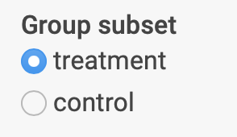

```{r, include = FALSE}
knitr::opts_chunk$set(
  collapse = TRUE,
  comment = "#>"
)
```

The deployment of a portal relies on two data files -- an expression matrix and a table with observed measures (e.g. clinical measures) -- and a configuration file that defines which modules should be displayed in the portal. In the simplest case, the data will have only one sample per subject -- an interactive command-line wizard can guide you step-by-step through the creation of the configuration file. If your data contains more than one sample per subject, for example, for different time points, the best approach is to run a function that creates an empty configuration file with placeholders for the fields in the configuration file that must be completed. This configuration file can then be modified in an editor such as RStudio or any other text editor. If your data has multiple samples per subject, you should also check the [Data Preparation Guide](dataprep.html) vignette, which describes the expected format for each data file.

## Using the wizard

The use of the interactive wizard requires placing files in the correct folders before starting. The following steps guide you through this. 

1. **Create a folder where the app will be located**

To facilitate the organization and deployment of the portal, it is better to create a folder that contains only the files that are related to the project. If you use RStudio, you may prefer to create a project.

2. **Copy the expression matrix file to the project folder**

The matrix can be a CSV, TSV (tab-separated columns) or .rds file with a `matrix` object (not a `data.frame`). The matrix should have HGNC or similar gene names in rows and sample identifiers in columns.

If your matrix has the following format, you can move on to the next step:

```{r, eval=TRUE, echo = FALSE}
x <- t(sapply(1:10, function(x) rnorm(6)))
rownames(x) <- lapply(1:10, function(x) { 
  paste(LETTERS[x:(x+2)], collapse = "")
})
smp_ids <- expand.grid(c("S1", "S2", "S3"), 1:2)
smp_ids <- sort(sprintf("%s_%02d", smp_ids[,1], smp_ids[,2]))
colnames(x) <- smp_ids
knitr::kable(as.data.frame(x))
```

3. **Copy a measures table file to the project folder**

This table can be a CSV, TSV or .rds file with a `data.frame` object. In this file, each row corresponds to a different subject and the order must match the order of samples in the expression matrix (if your data contains more than one sample per subject, you should follow the [Data Preparation Guide](dataprep.html) and not follow these steps). The first column of this table should be named and contain subject or sample identifiers.

If your measures table has the following format, you can move on to the next step:

```{r, eval = TRUE, echo = FALSE}
knitr::kable(
  data.frame(Sample_ID = c("S1", "S2", "S3"),
             Platelets_m01 = 150 + runif(3)*100,
             Platelets_m02 = 150 + runif(3)*100,
             Age = floor(runif(3, 30, 90)),
             drugNaive = c("Yes", "Yes", "No"))
)
```

4. *Optionally copy a metadata table file to the folder*

This table should also be in any the formats above and should not have any sample or subject identifier columns. The columns of this table will be used to populate the interface with radio buttons to allow sample subset selection. It should also follow a one row per subject/sample format.

Finally,

5. **In R, load the package and run `create_config_wizard()`**

If you are not using an RStudio project, ensure that the folder with the files is the current working directory. You can check the current working directory with `getwd()` and use `setwd("path/to/folder")` to modify it.

*The wizard will inform you about what each step is doing and will ask you questions about names of files and other details to create the configuration file*. It will also wait when you are required to do additional actions such as creating folders and copying files. Depending on your choices, at least two files will have been created when you finish it: `app.R` and `config.yaml`.

6. **Open and execute the code of app.R to test the portal**

Still using R (or RStudio) you can source the app.R file to run the code and open the portal on your browser. You can also copy the project folder to a Shiny server or use the [rsconnect](https://rstudio.github.io/rsconnect/) package to deploy it to shinyapps.io.

## Creating a config template

If your data is more complex than the case outlined above, you can run `create_config_template()` to create a config.yaml file that will contain placeholder names to be replaced. If you decide to use this method, you will have to create a lookup table file, by default named `lookup_table.csv`, which matches samples with subjects in the measures table and looks like the following:

```{r lookup_example, echo=FALSE}
print(data.frame(
  source = c("microarray", "microarray", "microarray") ,
  sample_id = c("sample_1", "sample_2", "sample_3"),
  subject_id = c("subject_1", "subject_2", "subject_3"),
  group = c("control", "treatment", "treatment")))
```
As you can see above, the lookup table also includes sample metadata information (group). Any metadata that you want to use to create subsets in the interface (e.g. to compute correlations only for a control group) should be included in this table and then defined in the configuration file under sample_categories, as following:

```yaml
sample_categories:
  - name: group
    label: Group
    values:
      - treatment
      - control
```

In the modules of the portal that allow the selection of subset of samples, the configuration above will appear as the following control: 

{width=33%}

### Including new modules in the configuration

After the config.yaml file has been created, you can edit it to modify the setup of modules that have already been defined or include new ones. The modules available in the package vary between their requirements and aims: some of them are more exploratory and only require changes to the configuration file, while others were designed to help showcase and explore results of analysis. If you have computed sets of genes using a package such as WGCNA, you can create a table to load them into the geneModulesHeatmap module, for example. In the current version, the following modules are available:

```{r show_av}
shinyExprPortal::show_available_modules()
```

The modules are split in their requirements as follows:

**No additional files needed**

- Single gene/multiple measures correlations
- Single measure/all genes correlation
- Multi-measure/all genes correlation
- Expression/measures changes over time

**Additional files needed**

- Differential expression models summary page: table of models, DE packages outputs (e.g. limma, deseq2, edgeR)
- Differential expression models visualization: table of models, DE packages outputs (e.g. limma, deseq2, edgeR)
- Gene modules heatmap: data frame with gene lists (WGCNA, genes of interest, etc.)
- 2D gene projection (e.g. MDS, UMAP): data frame with 2D coordinates for all genes

Check the [Full Configuration Guide](config.html) for details about each module and how to set up the additional files required by each of them.

### Deploying the portal remotely

You can deploy the app in your Posit/RStudio Connect server or in the public shinyapps.io website (note that you cannot password-protect the portal under the free plan). You can follow the [guide](https://shiny.rstudio.com/articles/shinyapps.html) to set up your account and install the required packages. The only other requirement is to change the app.R file by including the optional dependencies for each module (as listed in the configuration guide).

For example, the original app.R would look like this:

```{r original, eval=FALSE}
library(shinyExprPortal)
run_app("config.yaml")
```

If you want to use the geneModulesHeatmap module, to visualize heatmaps of lists of genes, you must also have the RColorBrewer installed. To deploy it in shinyapps.io, you must then import it as in the example below:

```{r changed, eval=FALSE}
library(shinExprPortal)
library(RColorBrewer)
run_app("config.yaml")
```

```